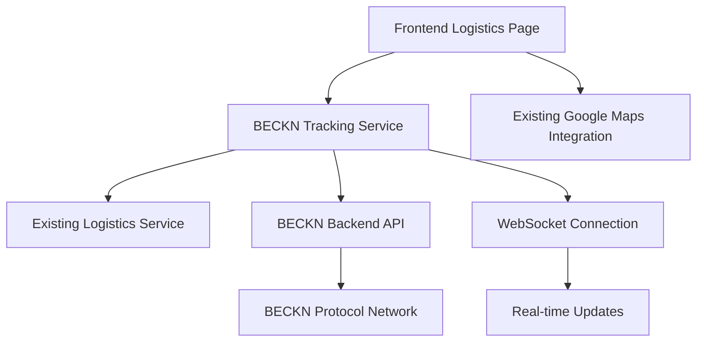

# Design Document

## Overview

The BECKN Order Tracker integration enhances the existing Logistics page by adding real-time order tracking capabilities through the BECKN protocol. This design leverages the existing `tracksmart_backend` BECKN infrastructure and seamlessly integrates with the current React-based logistics dashboard. The solution provides a hybrid approach that uses BECKN data when available and gracefully falls back to existing mock data, ensuring uninterrupted service.

## Architecture

### High-Level Architecture



### Integration Points

1. **Frontend Integration**: Extends existing `LogisticsPage.tsx` with BECKN tracking capabilities
2. **Service Layer**: New `becknTrackingService.ts` that interfaces with existing `logisticsService.ts`
3. **Backend Integration**: Utilizes existing `tracksmart_backend` BECKN routes and services
4. **Real-time Updates**: WebSocket integration for live tracking updates
5. **Map Integration**: Enhances existing Google Maps integration with BECKN location data

## Components and Interfaces

### Frontend Components

#### Enhanced LogisticsPage Component
- **Purpose**: Extends existing logistics page with BECKN tracking
- **Integration**: Adds BECKN data overlay to existing tabs
- **Fallback**: Maintains existing functionality when BECKN unavailable

#### BecknTrackingPanel Component
- **Purpose**: Displays BECKN-specific tracking information
- **Location**: Integrated within existing "Track Order" tab
- **Features**: Real-time status, delivery partner info, live location

#### BecknDeliveryPartnerCard Component
- **Purpose**: Shows BECKN delivery partner details
- **Integration**: Replaces/enhances existing travel company display
- **Data**: Partner name, rating, contact, vehicle info

### Service Layer

#### BecknTrackingService
```typescript
interface BecknTrackingService {
  trackOrder(orderId: string): Promise<BecknTrackingData | null>
  subscribeToUpdates(orderId: string, callback: (data: BecknTrackingData) => void): void
  unsubscribeFromUpdates(orderId: string): void
  getDeliveryPartner(orderId: string): Promise<BecknDeliveryPartner | null>
  getCurrentLocation(orderId: string): Promise<BecknLocation | null>
}
```

#### Enhanced LogisticsService
- **Extension**: Adds BECKN data integration methods
- **Hybrid Logic**: Merges BECKN data with existing order data
- **Fallback**: Maintains existing mock data when BECKN unavailable

### Backend Integration

#### BECKN Tracking Routes
```javascript
// New routes in tracksmart_backend
POST /beckn/track/:orderId - Get tracking data
GET /beckn/status/:orderId - Get current status
POST /beckn/subscribe/:orderId - Subscribe to updates
DELETE /beckn/unsubscribe/:orderId - Unsubscribe from updates
```

#### WebSocket Integration
- **Purpose**: Real-time order status updates
- **Implementation**: Extends existing backend with WebSocket support
- **Events**: `order_status_update`, `location_update`, `partner_assigned`

## Data Models

### BecknTrackingData Interface
```typescript
interface BecknTrackingData {
  orderId: string
  becknTransactionId: string
  status: BecknOrderStatus
  deliveryPartner?: BecknDeliveryPartner
  currentLocation?: BecknLocation
  estimatedDelivery: string
  actualDelivery?: string
  trackingHistory: BecknTrackingEvent[]
  lastUpdated: string
}
```

### BecknDeliveryPartner Interface
```typescript
interface BecknDeliveryPartner {
  id: string
  name: string
  phone: string
  email?: string
  rating: number
  vehicle: {
    type: string
    number: string
    model?: string
  }
  photo?: string
}
```

### BecknLocation Interface
```typescript
interface BecknLocation {
  latitude: number
  longitude: number
  address?: string
  timestamp: string
  accuracy?: number
}
```

### Enhanced Order Interface
```typescript
// Extension to existing Order interface
interface Order {
  // ... existing fields
  becknData?: BecknTrackingData
  isBecknEnabled: boolean
  becknFallbackReason?: string
}
```

## Error Handling

### BECKN Service Unavailable
- **Strategy**: Graceful degradation to existing mock data
- **User Experience**: Clear indicators showing data source
- **Logging**: Track BECKN availability for monitoring

### API Timeout Handling
- **Timeout**: 5-second timeout for BECKN API calls
- **Retry Logic**: Exponential backoff with max 3 attempts
- **Fallback**: Use cached data or existing logistics data

### Data Inconsistency
- **Priority**: BECKN data takes precedence when available
- **Conflict Resolution**: Log discrepancies for analysis
- **User Notification**: Indicate when data sources differ

### Network Connectivity
- **Offline Mode**: Cache last known BECKN status
- **Reconnection**: Automatic retry when connectivity restored
- **User Feedback**: Show connection status indicators

## Testing Strategy

### Unit Testing
- **BecknTrackingService**: Mock BECKN API responses
- **Component Integration**: Test BECKN data display
- **Error Scenarios**: Test fallback mechanisms
- **Data Transformation**: Verify BECKN to internal data mapping

### Integration Testing
- **Backend Integration**: Test BECKN API communication
- **WebSocket Testing**: Verify real-time update delivery
- **Map Integration**: Test location data display
- **Hybrid Data Flow**: Test BECKN + existing data merging

### End-to-End Testing
- **User Workflows**: Complete order tracking scenarios
- **Fallback Testing**: BECKN unavailable scenarios
- **Performance Testing**: High-traffic order tracking
- **Cross-browser Testing**: Ensure compatibility

### Mock Data Strategy
- **Development**: BECKN mock responses for local development
- **Testing**: Comprehensive test data covering edge cases
- **Demo Mode**: Toggle between real BECKN and mock data
- **Staging**: Controlled BECKN environment for testing

## Performance Considerations

### Caching Strategy
- **Order Data**: Cache BECKN responses for 30 seconds
- **Location Data**: Cache location updates for 10 seconds
- **Partner Data**: Cache delivery partner info for 5 minutes
- **Status Updates**: Real-time, no caching

### API Rate Limiting
- **Request Queuing**: Queue multiple BECKN requests
- **Batch Operations**: Group related API calls
- **Priority System**: Prioritize active tracking requests
- **Throttling**: Limit requests per user/session

### Real-time Updates
- **WebSocket Optimization**: Efficient message handling
- **Update Batching**: Group rapid status changes
- **Connection Management**: Handle connection drops gracefully
- **Memory Management**: Clean up subscriptions properly

## Security Considerations

### API Security
- **Authentication**: Use existing BECKN authentication
- **Rate Limiting**: Prevent abuse of tracking endpoints
- **Input Validation**: Sanitize order IDs and parameters
- **Error Handling**: Don't expose internal system details

### Data Privacy
- **Location Data**: Handle location information securely
- **Partner Info**: Protect delivery partner personal data
- **Logging**: Avoid logging sensitive information
- **Compliance**: Ensure GDPR/privacy regulation compliance

## Deployment Strategy

### Phased Rollout
1. **Phase 1**: Backend BECKN integration enhancement
2. **Phase 2**: Frontend UI integration with fallback
3. **Phase 3**: Real-time WebSocket implementation
4. **Phase 4**: Performance optimization and monitoring

### Feature Flags
- **BECKN_TRACKING_ENABLED**: Toggle BECKN integration
- **BECKN_REALTIME_UPDATES**: Enable WebSocket updates
- **BECKN_MAP_INTEGRATION**: Show BECKN locations on map
- **BECKN_FALLBACK_MODE**: Force fallback for testing

### Monitoring
- **BECKN API Health**: Monitor response times and errors
- **Fallback Usage**: Track when fallback is used
- **User Experience**: Monitor tracking success rates
- **Performance Metrics**: Track page load and update times